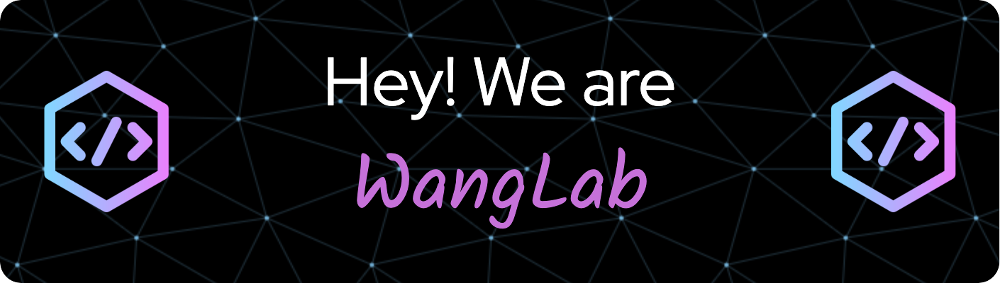

   
<h1 align="center">Hi 👋, We are Wang Lab</h1>
<h3 align="center">A reserach group at Beijing Institute of Genomics, Chinese Academy of Science</h3>

  

<!-- 
  
 -->

- 🔭 We currently working on **疾病风险新基因及新生物标志物发现，疾病风险预测以及生物计算服务关键云设施与平台**

- 👯 I’m looking to collaborate on **冠心病诊断、PRS**

- 🤝 I’m looking for help with **计算科学**

<!-- - 👨‍💻 All of my projects are available at [https://www.wallacemwang.site/projects_cn/](https://www.wallacemwang.site/projects_cn/)

- 📝 I regularly write articles on [https://www.wallacemwang.site/projects_cn/](https://www.wallacemwang.site/projects_cn/) -->

- 📫 How to reach me **https://www.wallacemwang.site/projects_cn/**

<h3 align="left">Connect with me:</h3>

<h3 align="left">Languages and Tools:</h3>

                           

<!-- 

&nbsp;

 -->
